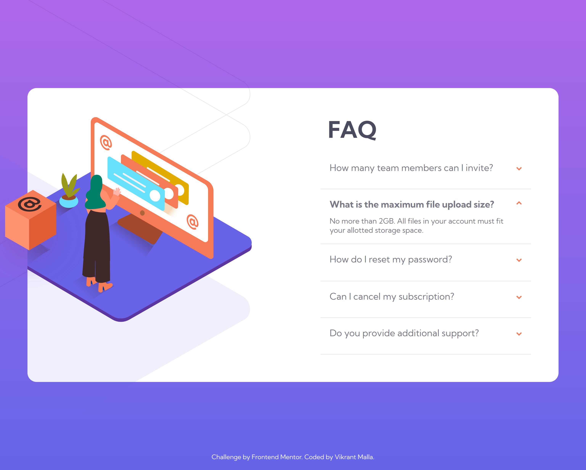
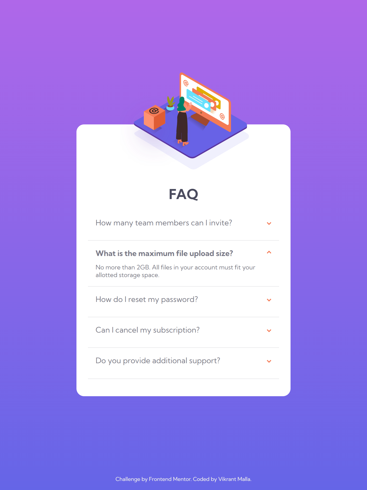

# Frontend Mentor - FAQ accordion card solution

This is a solution to the [FAQ accordion card challenge on Frontend Mentor](https://www.frontendmentor.io/challenges/faq-accordion-card-XlyjD0Oam). Frontend Mentor challenges help you improve your coding skills by building realistic projects.  

## Table of contents

- [Overview](#overview)
  - [The challenge](#the-challenge)
  - [Screenshot](#screenshot)
  - [Links](#links)
- [My process](#my-process)
  - [Built with](#built-with)
- [Author](#author)

## Overview

## The challenge

- View the optimal layout for the component depending on their device's screen size

### Screenshot

### Links

- [Solution URL](https://www.frontendmentor.io/profile/vikrantmalla)
- [Live Server](https://vikrantmalla.github.io/Faq-accordion-card/)

### Built with

- Semantic HTML5 markup
- SAAS
- Flexbox
- javascript
- Media Queries

## Author

- GitHub - [Vikrant Malla](https://github.com/vikrantmalla)
- Frontend Mentor - [@vikrantmalla](https://www.frontendmentor.io/profile/vikrantmalla)
